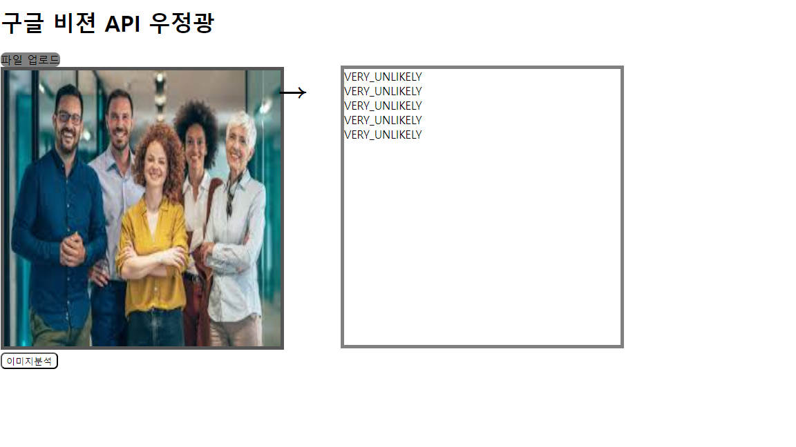
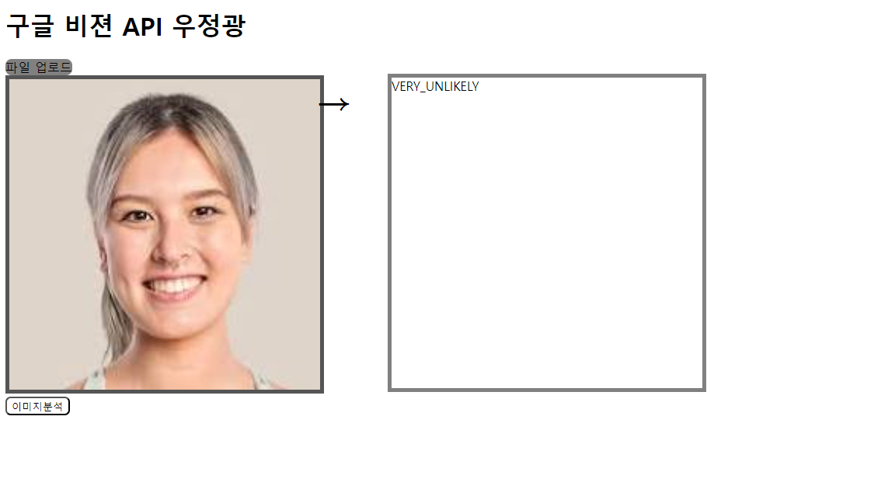

# project1-2024
2024-2학기 캡스톤 프로젝트 수업
OpenAPI를 사용한 인공지능 시스템 학습

# openweathermap
지정된 장소의 현재 날씨를 표시
[실습해보기](https://api.openweathermap.org/data/2.5/weather?q=london&units=metric&appid=7d96bc5108f52b80e2d9075a369b9f35)

```
$.ajax({
    type: "GET",
    url: 'https://api.openweathermap.org/data/2.5/weather?q=london&units=metric&appid=7d96bc5108f52b80e2d9075a369b9f35',
}).done(function(response) {

    console.log(response)
    let wdata = response
    let exdata = response.weather[0];

    temp.innerText = wdata.main.temp + "°C";
    min.innerText = wdata.main.temp_min;
    max.innerText = wdata.main.temp_max;
    wind.innerText = wdata.wind.speed;
    // alert(wdata.coord.lat)

    weather.innerText = exdata.main + "," + exdata.description;
    icon.setAttribute('src', icon_url + exdata.icon + ".png");
}).fail(function(error) {
    alert("!/js/user.js에서 에러발생: " + error.statusText);
});
```

# openai
openai의 api를 이용하여 질문과 이미지생성을 할 수 있게 만듦
```
    $.ajax({
        type:"POST",
        url: "https://api.openai.com/v1/chat/completions",
        headers:{
            "Authorization": "Bearer " + OPENAPI_KEY
        },
        data: JSON.stringify(data),
        contentType: "application/json; charset=utf-8"
    }).done( function(response){
        console.log(response)
        // alert(response.choices[0].message.content)
        txtOut.value = response.choices[0].message.content
    })
```
```
    $.ajax({
        type:"POST",
        url: "https://api.openai.com/v1/images/generations",
        headers:{
            "Authorization": "Bearer " + OPENAPI_KEY
        },
        data: JSON.stringify(data),
        contentType: "application/json; charset=utf-8"
    }).done( function(response){
        console.log(response)
        // alert(response.choices[0].message.content)
        gimage.src = response.data[0].url
        gimage2.src = response.data[1].url
    })
```

# google cloud vision
google cloud vision을 이용한 얼굴 표정의 분석을 할 수 있게 만듦
```
    $.ajax({
        type:"POST",
        url:'https://vision.googleapis.com/v1/images:annotate?key=' + VISION_API_KEY,
        headers:{
            "Accept": "application/json",
            "Content-Type": "application/json"
        },
        data: JSON.stringify(data),
        contentType: "application/json; charset=utf-8"
    })
```




개발순서
1. 소스 수정
2. 소스 저장
3. 스테이지
4. 커밋 앤 푸쉬
5. 커밋 메세지

두번쨰 수정

2024-09-19 깃허브 연동 실습
로컬에서 편집함